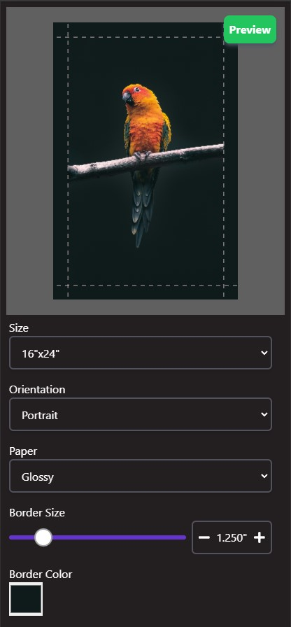
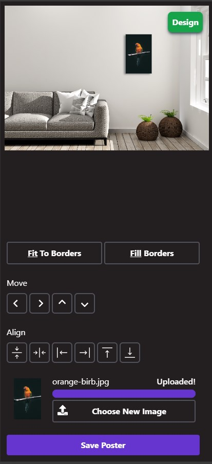

# Poster Designer Frontend

Frontend for poster designer. Users can upload their poster image here, choose settings, crop as desired and customize borders. Once done they can save the poster. If they came from Etsy listing they'll get a poster ID to put in their purchase notes. If they came from the shopify site, the embedded editor will automatically associate the poster ID with their purchase.

## Setup

Run `npm install` in this directory.

## Running
### Local only
To run just the frontend locally you can run `npm start`.

### Local frontend + hosted backend
To run the frontend locally with a backend connection, first run go to the repo's root directory and run `npm start`. Then in this directory (designer/) run `npm run dev`