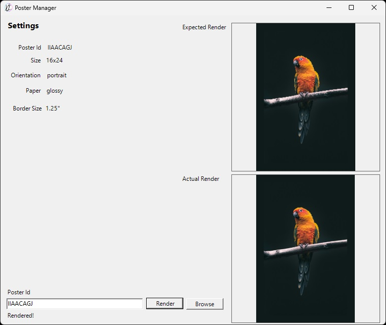

# Poster Manager

This is a win-forms app used to render a given poster for printing. It takes a poster id and downloads the image and settings associated. It then renders out the full high DPI image for printing. 

This final rendering is done outside of the user's workflow as it can take a while to render the image as they can get very large in dimensions (10k+ pixels wide) depending on the poster size and DPI. Doing this on the user's end could end up requiring them to wait tens of seconds on the final step of saving the poster. So instead only the original image is uploaded during editing along with a small preview thumbnail of the poster at time of saving. The preview thumbnail can be used to check that the final rendering actually matches what the user designed in the browser.

## Setup

Requires dotnet 6.0 or later.

### Build
`dotnet build`

### AWS Access
Configure AWS access at in appsettings.json. A template can be found [here.](PosterManager/appsettings.json) Copy the template to the same directory as PosterManager.exe, somewhere in PosterManager/bin and edit with your credentials and appropriate dynamodb table and upload bucket.